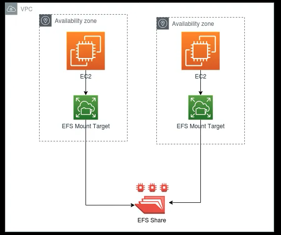
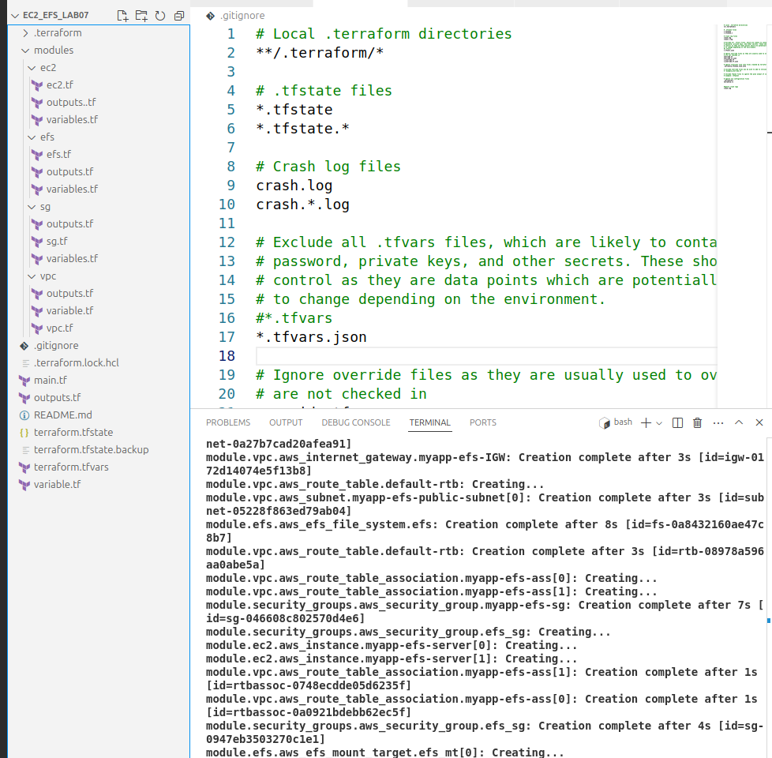
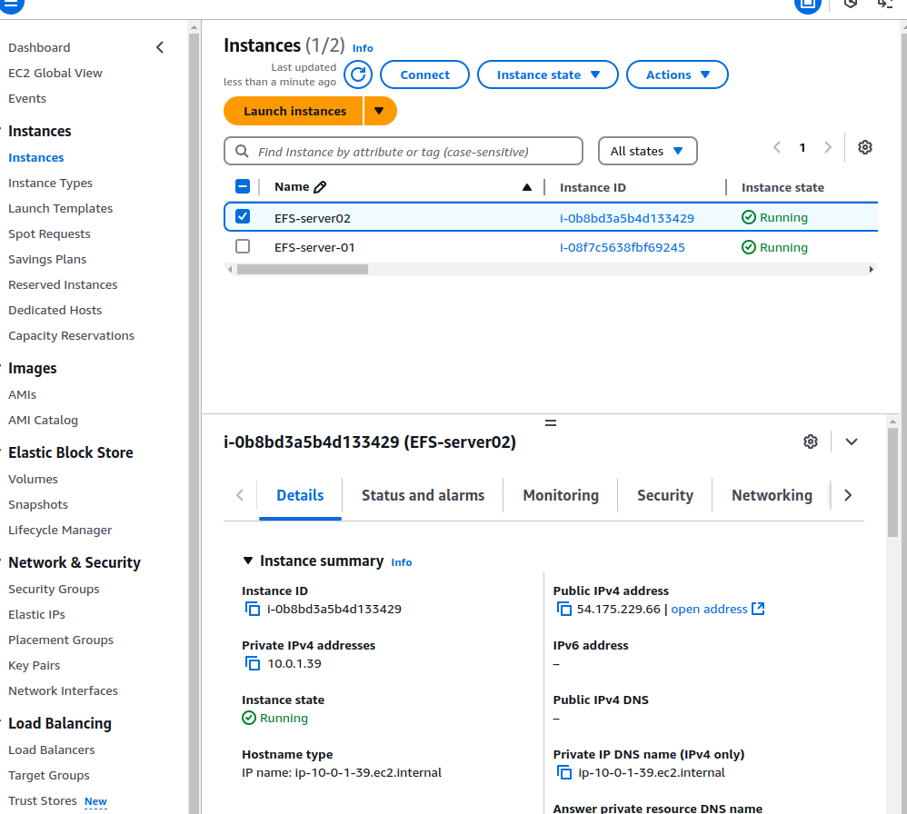
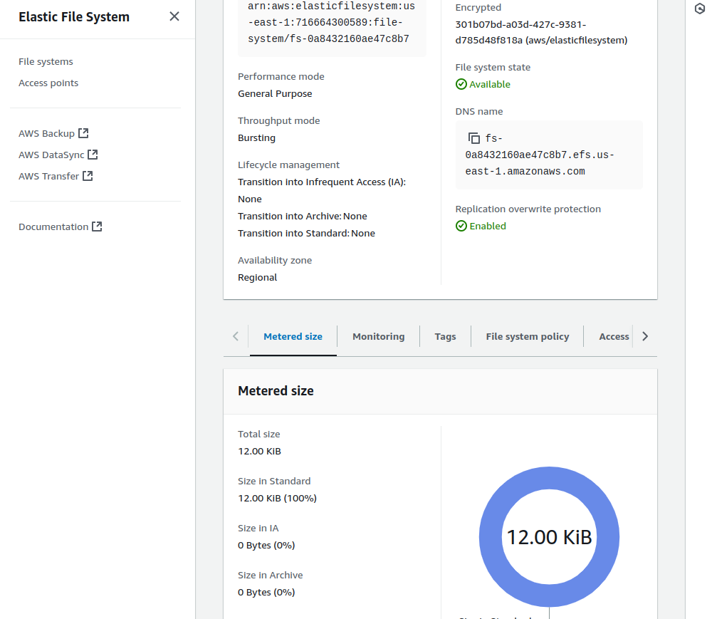
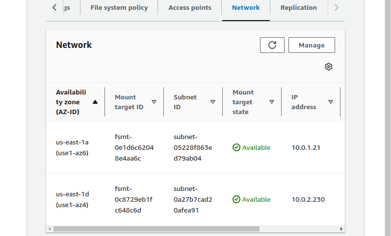
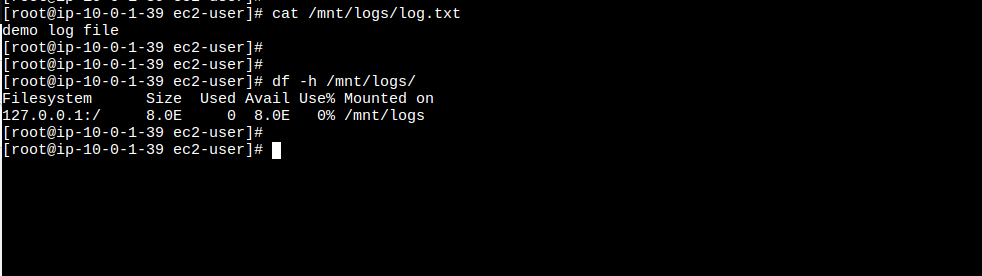
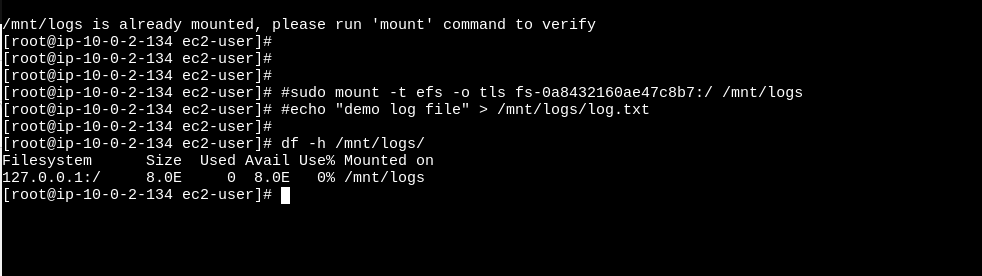

# Terraform AWS EFS + EC2 Setup

This repository contains Terraform modules to create an **Amazon EFS (Elastic File System)** and mount it on an **EC2 instance** in AWS. The infrastructure is designed using a **modular approach** for reusability and scalability.

---



## Architecture Overview

The setup includes:
1. **VPC**: A virtual private cloud with public subnets.
2. **Security Groups**: For EC2 (SSH access) and EFS (NFS access).
3. **EFS**: A scalable, shared file system for centralized storage.
4. **EC2 Instance**: An Amazon Linux 2 instance with EFS auto-mounted at boot.

---

## Prerequisites

1. **AWS Account**: Ensure you have an AWS account with the necessary permissions.
2. **Terraform Installed**: Install Terraform from [here](https://www.terraform.io/downloads.html).
3. **AWS CLI Installed**: Install and configure the AWS CLI with your credentials:
   ```bash
   aws configure

4. **Git**: Install Git to clone this repository.

```bash
terraform-aws-efs-ec2/
├── main.tf
├── variables.tf
├── outputs.tf
├── modules/
│   ├── vpc/
│   │   ├── main.tf
│   │   ├── variables.tf
│   │   ├── outputs.tf
│   ├── security_groups/
│   │   ├── main.tf
│   │   ├── variables.tf
│   │   ├── outputs.tf
│   ├── efs/
│   │   ├── main.tf
│   │   ├── variables.tf
│   │   ├── outputs.tf
│   ├── ec2/
│   │   ├── main.tf
│   │   ├── variables.tf
│   │   ├── outputs.tf

```

***Step by Step***: Instructions

1. **Clone the Repository**

Clone this repository to your local machine:

```bash
git clone https://github.com/waseemuddin/TerraformWithAWSBootCamp.git
cd TerraformWithAWSBootCamp
git checkout feature/efs_lab01
```

2. **Initialize Terraform**
Run the following command to initialize Terraform and download the required providers:

```bash
terraform init
terraform fmt
terraform validate
terraform plan

```

3. **Review the Configuration**
The main.tf file in the root directory defines the infrastructure using the modules. Review the variables in variables.tf and update them if necessary.


4. **Apply the Terraform Configuration**
Deploy the infrastructure by running:

```bash
terraform apply
```

Terraform will display the execution plan. Type yes to confirm and proceed.

5. **Verify the Deployment**









EC2 Instance:
SSH into the EC2 instance using its public IP:

```bash
ssh ec2-user@<EC2_PUBLIC_IP>
df -h /mnt/efs
echo "Hello, EFS!" > /mnt/efs/test.txt
cat /mnt/efs/test.txt
EFS File System:
```

Go to the AWS Management Console > EFS and verify the file system is created and in the available state.

6. **Destroy the Infrastructure**
To clean up and avoid unnecessary charges, destroy the infrastructure:

```bash
terraform destroy
```
